# Prediction of Prices in Agriculture (PREPARE)

## Final Project Report

---

## Cover Page

**Project Title:** Prediction of Prices in Agriculture (PREPARE)

**Institution:** Plaksha University

**Group Members:**
| Name | Role / Work Distribution |
|------|--------------------------|
| Varun SG | Data collection, scraping, EDA |
| Kunal Ranjan | Imputation pipeline, feature engineering |
| Aryan Gosain | Model development, graph architectures |
| Rishit Anand | App development, evaluation, integration |

**Faculty Guide:** Prof. Mayank Ratan Bhardwaj

**Date:** 9 May 2026

---

## Abstract

Agricultural price volatility is one of the most pressing challenges for India's small and marginal farmers, who lack reliable tools to anticipate market shifts. PREPARE (Prediction of Prices in Agriculture) addresses this problem by building a multi-day commodity price forecasting system for four key crops (onion, potato, tomato, and wheat) across hundreds of mandis (agricultural markets) nationwide.

We scraped three years of daily mandi-level price and arrival data (January 2023 to December 2025) from the Agmarknet portal and developed an imputation pipeline to handle the 65-75% structural missingness inherent in government-reported agricultural datasets. We then conducted a broad model comparison spanning naive baselines, gradient-boosted tabular models, cross-crop feature augmentation, density- and volume-aware variants, and deep spatiotemporal graph neural networks.

Our best-performing architecture, a Graph Attention Network with GRU temporal encoding (GAT-GRU), achieved 15-day R-squared scores of 0.81 (onion), 0.94 (potato), 0.39 (tomato), and 0.70 (wheat), substantially exceeding the previous-day baseline (which achieves an R-squared of only 0.94 for same-day prediction on onion) and all non-graph alternatives. The final models have been integrated into a bilingual mobile application built with FastAPI, enabling farmers and regulators to access real-time, location-specific price forecasts for horizons of 1 to 15 days.

**Keywords:** agricultural price forecasting, graph neural networks, GAT-GRU, mandi networks, spatiotemporal modeling

---

## 1. Introduction

### 1.1 Motivation

India's agricultural markets serve over 140 million farming households, yet price discovery remains opaque for most producers. Small and marginal farmers, who constitute over 86% of Indian landholdings, typically make selling decisions based on word-of-mouth or day-of-sale prices. This leads to distress sales during supply gluts and missed opportunities during demand peaks. The absence of reliable, multi-day price forecasts creates an information asymmetry that systematically disadvantages producers relative to intermediaries and large traders.

Government bodies and regulators also face challenges. Policy interventions such as buffer stock releases, export restrictions, or minimum support price adjustments require advance knowledge of price trajectories, yet existing forecasting tools are either too coarse (monthly or quarterly national averages) or too limited in geographic coverage to support localized decision-making.

This project takes the work of Bhardwaj (2023) [1] as its starting point.

### 1.2 Problem Statement

We aim to build a system that provides accurate daily price forecasts for 1 to 15 days ahead, at the individual mandi level, for four crops central to India's food economy:

- **Onion**: high volatility, politically sensitive pricing
- **Potato**: staple with strong regional price persistence
- **Tomato**: highly perishable, large seasonal swings
- **Wheat**: rabi seasonal crop with distinct geographic production zones

### 1.3 Prior Work

Time-series forecasting for agricultural commodities has been explored using ARIMA, VAR, and LSTM-based approaches in prior literature. However, most existing studies treat each market independently, ignoring the spatial dependencies between geographically proximate mandis. Recent advances in spatiotemporal graph neural networks, including STGCN [2], GraphWaveNet [3], and DCRNN [4], have shown promise in traffic and weather forecasting by modeling spatial relationships as graph edges. Our work adapts these ideas to the mandi network, where nodes represent individual markets and edges encode geographic proximity, price correlation, and administrative relationships. The graph attention mechanism from Velickovic et al. (2018) [5] is central to our final architecture.

### 1.4 The PREPARE App

To bridge the gap between model predictions and end-user accessibility, we developed a bilingual mobile application during Semester 5, supporting two languages to maximize accessibility for farmers across different regions. The app features:

- **Interactive Map View:** An interactive map interface where users can browse and select mandis geographically, providing an intuitive spatial entry point into the forecasting system.
- **Crop Selection Screen:** A dedicated screen to connect crops to selected mandis, allowing users to choose among onion, potato, tomato, and wheat.
- **Highest-Price Display:** Once a crop and set of mandis are selected, the app highlights which mandis currently have the highest predicted prices for that crop, enabling farmers to identify the most profitable selling locations.
- **Day-Horizon Slider:** A slider control that lets users pick the specific forecast day (1 through 15), dynamically updating the displayed predictions to show how prices are expected to evolve over the coming two weeks.

The backend is powered by a FastAPI server that serves predictions from our trained models in real time. The final trained models have been integrated into the app's prediction pipeline, enabling live forecasts for all four crops across the mandi network.

---

## 2. Data Collection and Preparation

### 2.1 Data Scraping

We wrote a scraping pipeline using Python and Playwright to pull daily market data from the Agmarknet portal (the Government of India's official agricultural market information network). Playwright was used to automate browser-based navigation of the portal, which does not expose a public API and requires interactive form submission for each commodity, state, and date range. The scraper collected records for the period January 2023 to December 2025, covering:

- Modal prices (Rs. per quintal)
- Arrival quantities (metric tonnes)
- Market, district, and state identifiers
- Commodity classification

The raw data was cleaned using a multi-pass pipeline that removed repeated headers, title rows, footnotes, and duplicate entries, and standardized column names, date parsing, and numeric types.

### 2.2 Dataset Summary

The raw scraped data was first expanded to a full date-by-mandi grid (one row per mandi per calendar day), then filtered to retain only mandis with at least 50% data availability. After this density filtering, the final working dataset contains:

| Crop | Original Mandis | Retained Mandis | Retained Rows | Date Range |
|------|----------------|-----------------|---------------|------------|
| Onion | 1,474 | 764 | 470,964 | Jan 2023 to Dec 2025 |
| Potato | 1,388 | 713 | 459,012 | Jan 2023 to Nov 2025 |
| Tomato | 1,506 | 693 | 492,870 | Jan 2023 to Dec 2025 |
| Wheat | 1,421 | 475 | 295,535 | Jan 2023 to Nov 2025 |

Sugarcane was initially included but dropped due to roughly 98.6% missing data (only 19 mandis with 273 total data points, none meeting the 50% density threshold).

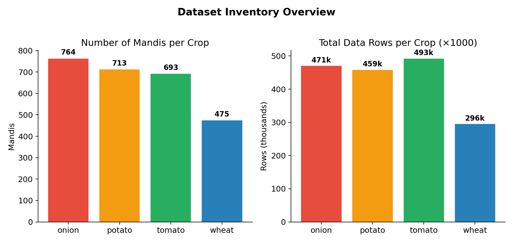

### 2.3 Geographic Coverage

Mandi coverage spans 25+ Indian states, with Uttar Pradesh dominating for vegetables and Madhya Pradesh for wheat:

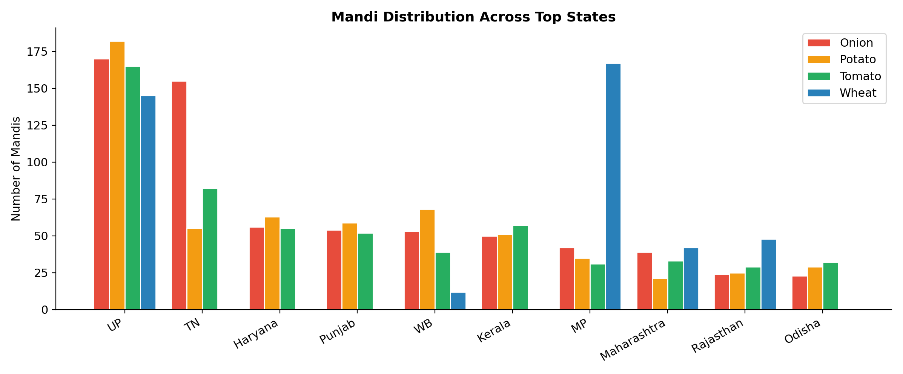

Key observations:
- Uttar Pradesh has the highest mandi counts for onion (170), potato (182), and tomato (165)
- Madhya Pradesh leads for wheat (167 mandis), reflecting its position as India's largest wheat-producing state
- Wheat has the smallest mandi network overall (475 vs 693-764 for vegetables)

### 2.4 Missing Data Analysis

Structural missingness is a defining characteristic of Indian agricultural data. Our EDA revealed:

- **Overall missing rates:** 65-75% across crops after grid expansion
- **Day-of-week patterns:** Sundays show 76-80% missing rates (most mandis are physically closed) vs roughly 64-68% on weekdays
- **Long gaps:** Over 600 mandis per crop have consecutive missing streaks exceeding 3 months
- **State variation:** West Bengal and Uttar Pradesh have the most complete data (roughly 40-50% missing); Assam and smaller northeastern states exceed 98% missing

### 2.5 Imputation Pipeline

We benchmarked 10 imputation strategies at multiple data-availability thresholds (0%, >=50%, >=75%):

1. **Rolling Mean**: trailing window average
2. **Capped Forward Fill**: forward-fill with temporal decay
3. **State-Day Average**: spatial proxy using same-state, same-day means
4. **Historical Seasonality**: month by day-of-week norms
5. **Global Crop Median**: structural safety net
6. **Forward Fill with Spatial Decay**: blends temporal and spatial signals
7. **DOW Ratio (Day of Week)**: applies historical Sunday-to-weekly-average ratios
8. **Spline Pipeline**: cubic spline with outlier flagging and smoothing (derived from our mentor's previous work [1])
9. **Random Forest**: predicts missing values from contextual features
10. **SVD Matrix Factorization**: treats data as a Date-by-Mandi matrix

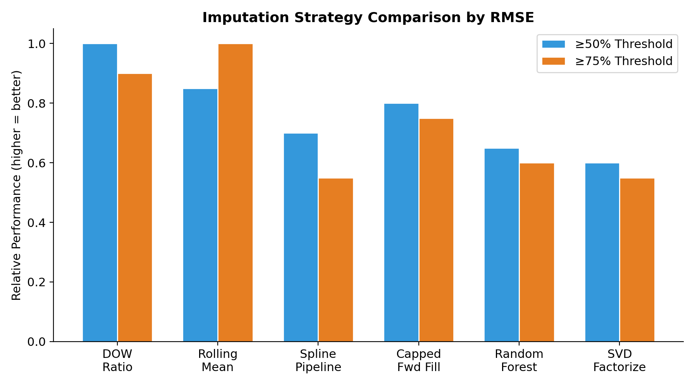

Results:
- **DOW Ratio** dominated at the >=50% threshold and remained competitive at >=75%, effectively handling structural weekend missingness
- **Rolling Mean** won at >=75% for crops like potato and wheat where dense surrounding data was available
- **Spline Pipeline** excelled at the 0% threshold (bridging multi-month gaps) but over-smoothed dense data
- **Capped Forward Fill** achieved the best MAE but worst RMSE due to stale-price outliers

We adopted DOW Ratio for mandis with >=50% data availability per year. After imputation, fill rates were: onion 52.7%, potato 65.4%, tomato 53.6%, wheat 78.3% of the remaining missing values. No originally observed prices were modified during imputation.

### 2.6 Weather Data Extraction

The dataset was enriched with weather data from the ERA5 reanalysis product provided by the Copernicus Climate Data Store. For each mandi, its geographic coordinates (latitude and longitude) were used to extract hourly weather observations from the nearest 0.25-degree grid cell. The four weather variables included are:

- **t (temperature)**: 2-metre air temperature in degrees Celsius
- **tp (total precipitation)**: hourly precipitation in mm
- **ssr (surface net solar radiation)**: in MJ/m-squared
- **r (relative humidity)**: computed from temperature and dewpoint using the Magnus formula

These are stored in the final dataset as 24 hourly columns per variable (e.g. t00 through t23, tp00 through tp23, ssr00 through ssr23, r00 through r23), giving 96 hourly weather columns per row.

### 2.7 Feature Engineering

The columns present in the final dataset for each mandi-by-date observation are:

- State, District, Market, Commodity_Group, Commodity (identifiers)
- Date, Day_of_Week (temporal identifiers)
- Arrival_Quantity, Arrival_Unit, Modal_Price, Price_Unit (core market data)
- latitude, longitude (geographic coordinates)
- 96 hourly weather columns: t00-t23, tp00-tp23, ssr00-ssr23, r00-r23

Many of the features used for modeling were derived during training rather than stored in the dataset. These model-specific engineered features include:

- **Price features:** Causally filled modal price, lagged prices, rolling means (7-day, 28-day), rolling standard deviations, log-transformed prices
- **Arrival features:** Causally filled arrivals, log-transformed arrivals
- **Calendar features:** Month, day of year, week of year, year (extracted from Date)
- **Weather aggregates:** Daily mean/min/max temperature, temperature range, total rainfall, total and peak solar radiation, mean/min/max relative humidity (aggregated from the 24 hourly columns)
- **Spatial features:** State-level mean price and arrival, national-level mean price and arrival
- **Graph-derived features:** Neighbor mean prices and rolling averages at various distance thresholds

---

## 3. Methodology

### 3.1 Experimental Design

We structured our experiments as a systematic progression from simple baselines to complex graph-based architectures, ensuring every model family was benchmarked against strong naive baselines:

**Evaluation Protocol:**
- **Validation window:** Trailing 90-day period at the end of each crop's date range
- **Metrics:** R-squared (primary), WAPE (Weighted Absolute Percentage Error), RMSE, MAE
- **Horizons:** 1-day and 15-day (with sweeps across 1-15 days for baselines)

### 3.2 Same-Day Persistence Baseline

As a fundamental reference point, we measured how well yesterday's price predicts today's observed price. This "same-day previous price" baseline establishes the inherent day-to-day price persistence in each crop:

| Crop | Validation Rows | Same-Day R-squared | Same-Day WAPE |
|------|----------------|-------------------|---------------|
| Onion | 8,678 | 0.9357 | 4.51% |
| Potato | 4,113 | 0.9593 | 4.21% |
| Tomato | 29,374 | 0.8852 | 7.61% |
| Wheat | 528 | 0.6794 | 1.37% |

This baseline shows how persistent prices already are: potato and onion prices change very little from one day to the next, while tomato is the most volatile.

### 3.3 Baseline Models

Four naive baselines were evaluated across all forecast horizons:

| Baseline | Description |
|----------|-------------|
| Previous-day price | Use yesterday's price to predict the future target |
| Rolling mean (7-day) | 7-day trailing rolling mean |
| Rolling mean (28-day) | 28-day trailing rolling mean |

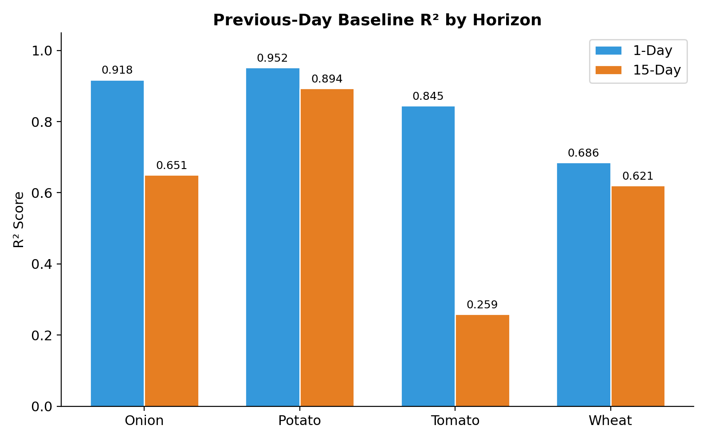

Key finding: The previous-day baseline is already strong at 1-day (R-squared 0.69-0.95), but the rolling baselines, not naive persistence, are the hard baselines to beat at 15 days.

### 3.4 Tabular Models

We tested progressively more complex tabular approaches:

1. **Simple Numeric HistGradientBoosting**: single regressor over engineered features
2. **Anchored HistGB**: predicts a correction (delta) around an anchor (rolling mean), then inverts back to price
3. **Cross-Crop HistGB**: adds paired crop price features based on national correlation analysis
4. **Classical Linear Models**: LinearRegression, Ridge, ElasticNet
5. **Focused Tuned Models**: XGBoost [6], LightGBM [7], ExtraTrees with compact deterministic tuning

Cross-crop pairings (by strongest daily national price correlation):

| Crop | Paired With | Correlation |
|------|------------|-------------|
| Onion | Wheat | 0.764 |
| Potato | Onion | 0.678 |
| Tomato | Potato | 0.217 |

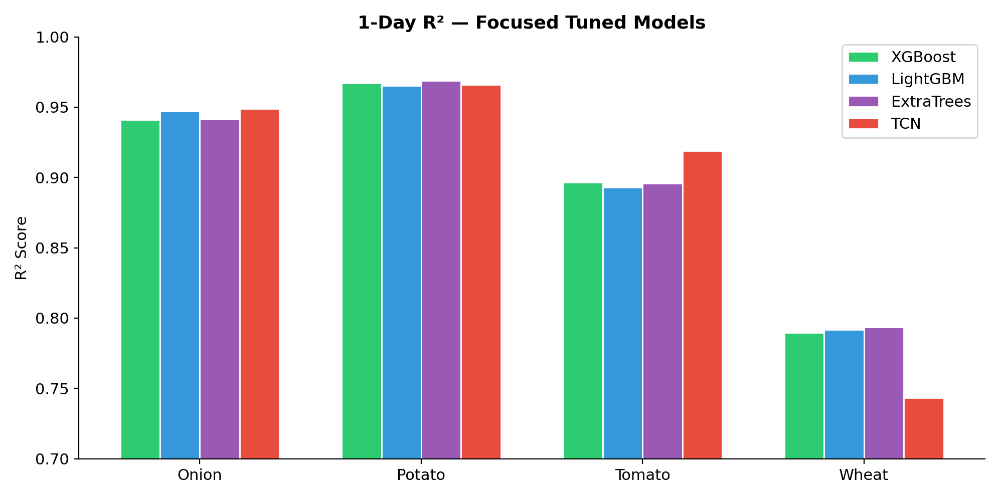

### 3.5 Specialized Variants

- **Density-Bucket HistGB:** Splits mandis by graph density (number of geographic neighbors within threshold)
- **Volume-Cluster HistGB:** Groups mandis by arrival volume clusters
- **TCN (Temporal Convolutional Network):** Windowed sequence model over price, arrival, and calendar features

### 3.6 Graph Neural Network Models

The core contribution of PREPARE is the application of spatiotemporal graph models to the mandi network.

**Graph Construction:**
- **Nodes:** One node per mandi (market)
- **Edges:** Constructed from geographic proximity (distance thresholds), price correlation, state/administrative grouping, and volume-based clustering
- **Edge weights:** Configurable blend of correlation-heavy, geo-heavy, and state/cluster-heavy presets

**Architectures tested:**
1. **GraphWaveNet / GraphWaveNet+** [3]: adaptive adjacency matrix learning
2. **SAGMM-inspired model** [8]: self-adaptive graph mixture of models
3. **GAT-GRU**: Graph Attention Network [5] encoder with GRU temporal decoder, predicting residuals around crop-specific anchors

**Target Formulations:** A critical finding was that the choice of prediction target matters more than most architectural hyperparameters:
- `delta_current`: predict deviation from current price
- `delta_roll7`: predict deviation from 7-day rolling mean
- `delta_roll28`: predict deviation from 28-day rolling mean

**GAT-GRU Ablations performed:**
- Graph mode: full graph, geo-only, correlation-only, temporal-only, shuffled graph
- Target mode sweep: delta_current, delta_roll7, delta_roll28
- k-neighbors sweep: 6, 10, 14, 18
- Edge-weight presets: correlation-heavy, geo-heavy, state/cluster-heavy
- Radius threshold sweep: 75km, 150km, 300km (plus 10km, 25km, 50km refinement for onion)

---

## 4. Results

### 4.1 One-Day Forecast Results

| Crop | Same-Day Baseline R-squared | Previous-Day R-squared (1d) | Best Overall 1-Day Model | R-squared |
|------|---------------------------|---------------------------|--------------------------|-----------|
| Onion | 0.9357 | 0.9180 | ElasticNet | 0.9535 |
| Potato | 0.9593 | 0.9518 | ElasticNet | 0.9705 |
| Tomato | 0.8852 | 0.8448 | TCN (tuned) | 0.9191 |
| Wheat | 0.6794 | 0.6859 | ExtraTrees (tuned) | 0.7935 |

One-day prediction is relatively easy since prices change slowly from day to day. Learned models provide modest gains, with tomato and wheat benefiting most from non-baseline approaches.

### 4.2 Fifteen-Day Forecast Results

| Crop | 15-Day Baseline | Best Rolling Baseline | Best Non-Graph | **Best Graph (GAT-GRU)** |
|------|------|------|------|------|
| Onion | 0.6508 | 0.7788 | 0.7075 | **0.8134** |
| Potato | 0.8937 | 0.9336 | 0.9365 | **0.9380** |
| Tomato | 0.2588 | 0.3791 | 0.3675 | **0.3914** |
| Wheat | 0.6209 | 0.6663 | 0.6764 | **0.7026** |

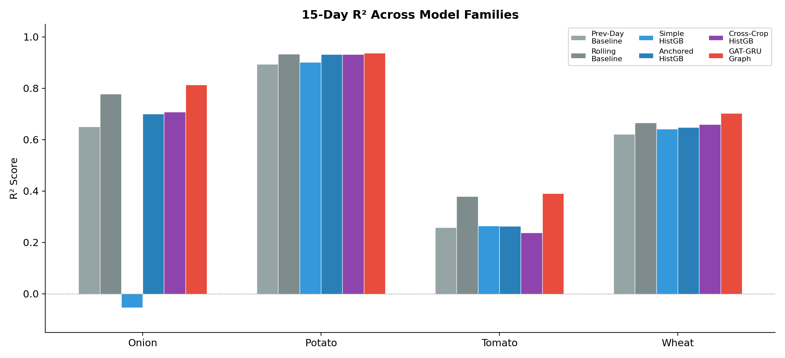

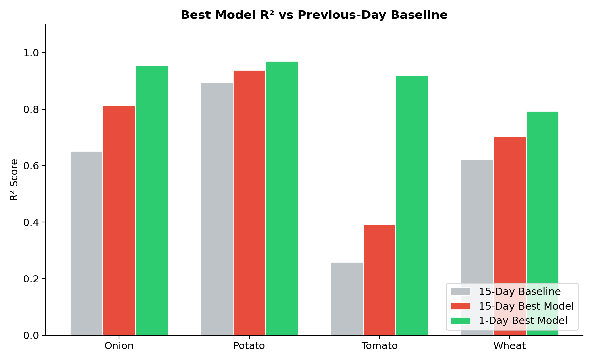

### 4.3 R-squared Decay Over Forecast Horizon

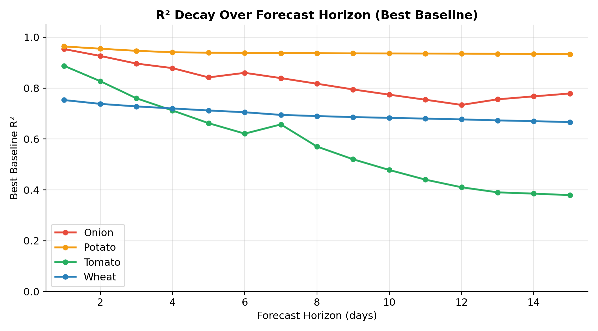

This plot shows how forecast difficulty increases with horizon length. Potato maintains the most stable performance, while tomato degrades the fastest, reflecting its extreme price volatility due to perishability.

### 4.4 Graph vs Non-Graph Analysis

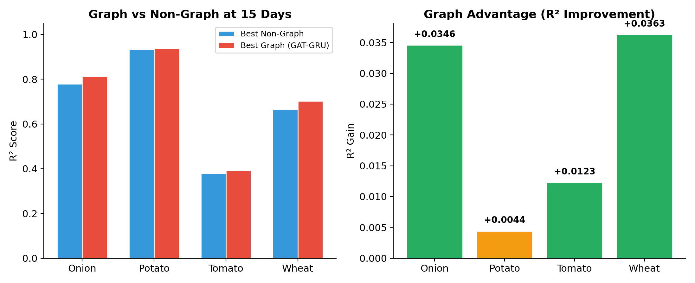

| Crop | Graph R-squared | Non-Graph R-squared | Graph Advantage |
|------|----------------|--------------------|-----------------| 
| Onion | 0.8134 | 0.7788 | +0.0344 |
| Potato | 0.9380 | 0.9336 | +0.0044 |
| Tomato | 0.3914 | 0.3791 | +0.0123 |
| Wheat | 0.7026 | 0.6663 | +0.0363 |

Insights:
- Graph models clearly benefit onion and wheat (gains of roughly 0.03-0.04 R-squared)
- Potato shows a small but real graph gain
- Tomato's graph gain only materializes after radius thresholding within the GAT

### 4.5 WAPE Analysis

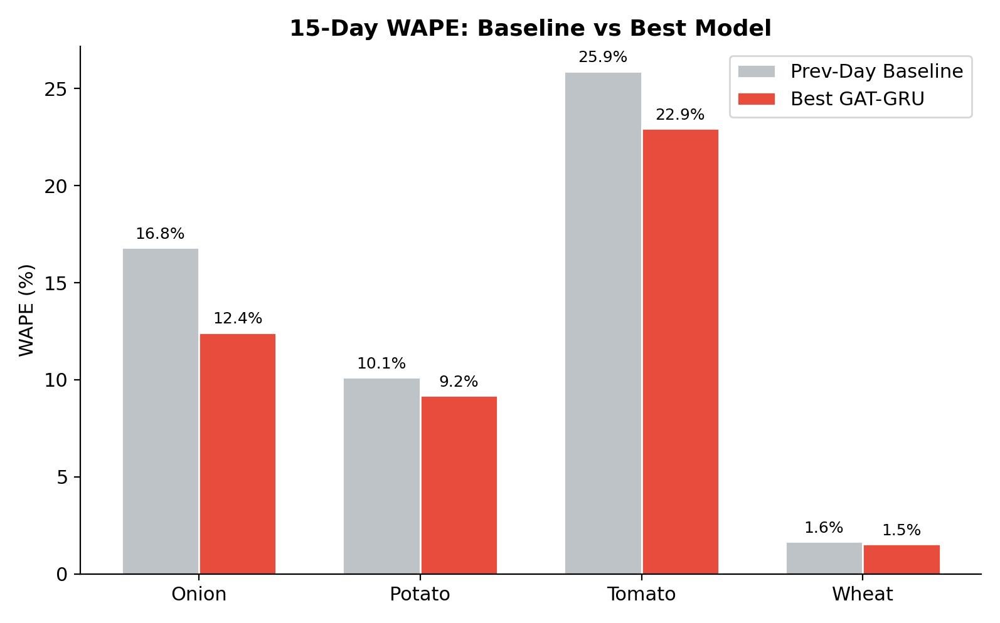

The best GAT-GRU models reduce WAPE by 2-4 percentage points relative to the naive baseline across all crops. Wheat achieves the lowest absolute WAPE (1.54%) due to its inherently stable pricing.

### 4.6 Radius Threshold Analysis

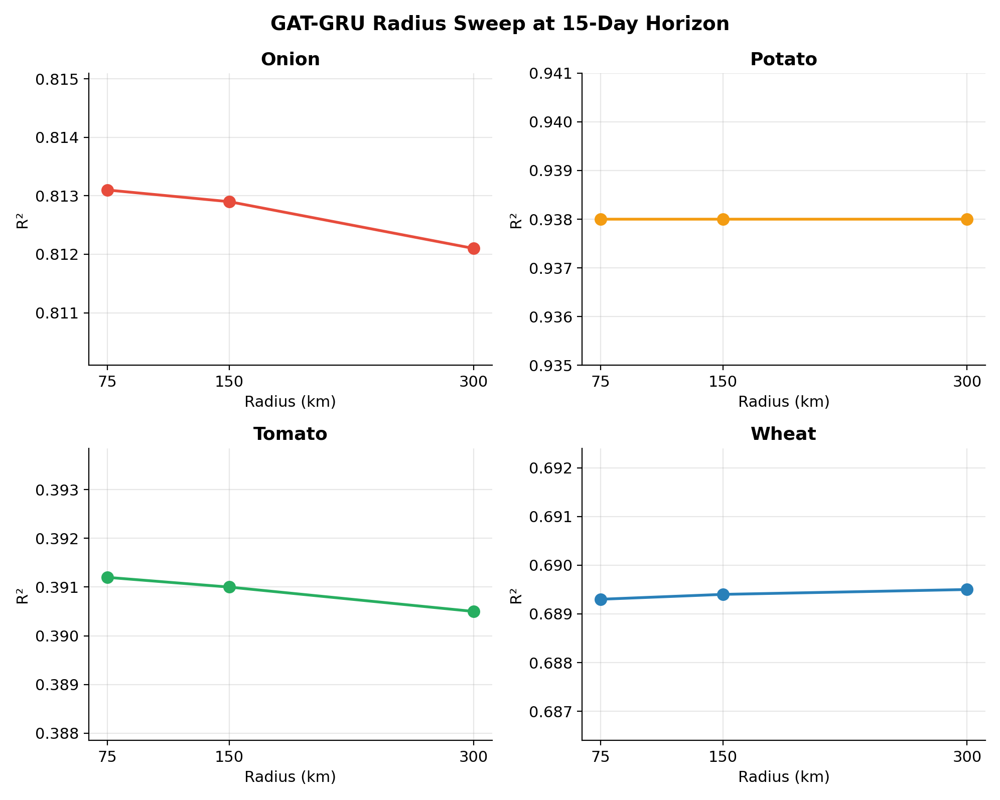

The radius sweep tested 75km, 150km, and 300km thresholds for the deep GAT-GRU model. For onion, an additional refinement at 10km, 25km, and 50km was performed since it showed a slight preference for tighter graphs.

| Crop | Best Target Mode | Optimal Radius | R-squared |
|------|-----------------|----------------|-----------|
| Onion | delta_roll28 | 25km (refined) | 0.8134 |
| Potato | delta_roll28 | 75-300km (flat) | 0.9380 |
| Tomato | delta_roll28 | 75km | 0.3912 |
| Wheat | delta_current | Full graph (no radius) | 0.7026 |

An important observation is that below 75km, the differences between radius settings are very small. Onion's refined low-radius sweep (10km, 25km, 50km) showed R-squared values of 0.8133, 0.8134, and 0.8132 respectively, which are effectively indistinguishable. The low-radius refinement was only conducted for onion; for tomato, the test was done at 75km and above, and finer thresholds were not tested separately.

### 4.7 Key Ablation Findings

- **Target formulation is the most important lever.** The delta_roll28 target was optimal for onion, potato, and tomato; delta_current was best for wheat. This single choice mattered more than edge-weight tuning, k-neighbors changes, or graph-mode selection.
- **Graph structure matters by crop.** Wheat clearly benefits from real graph structure (full graph significantly outperforms shuffled graph). For onion, shuffled graph performs similarly, meaning the GRU temporal encoding provides most of the gain rather than the spatial edges. Potato is intermediate.
- **GraphWaveNet+ was not competitive.** The architecture did not suit this problem compared to GAT-GRU.
- **SAGMM-inspired models** [8] were also tested but did not produce competitive results in our setting.

---

## 5. Reflection

### 5.1 What Worked

- **Systematic baseline evaluation:** By establishing strong rolling-mean baselines early, we avoided the common pitfall of reporting inflated improvements over weak baselines. The rolling 28-day mean turned out to be the real bar to clear at 15 days, not the naive previous-day prediction.
- **Anchored residual prediction:** Predicting deviations from a crop-specific anchor rather than raw prices improved model stability across all crops.
- **DOW Ratio imputation:** This strategy effectively solved the structural weekend/Sunday missingness pattern that dominated our data, and was derived from analysis of the actual data-reporting patterns of mandis.
- **Graph-based spatial modeling:** The GAT-GRU architecture captured inter-mandi dependencies, especially for onion and wheat where the graph advantage was statistically meaningful.

### 5.2 What Did Not Work

- **Early graph models (GraphWaveNet, SAGMM-style):** Failed initially due to weak edge construction, thinner feature sets compared to the tabular pipeline, and direct price prediction rather than residual forecasting.
- **Cross-crop features:** Provided only modest gains for crops with strong correlations (onion-wheat) and actually hurt performance for weakly correlated pairs (tomato-potato).
- **Simple tabular models at 15 days:** Collapsed for onion (negative R-squared) and was weak for tomato, showing that tabular models without spatial awareness are not sufficient for long-horizon forecasting.
- **Density and volume bucketing:** Useful as diagnostic tools but did not produce better final models than the baselines they were compared against.

### 5.3 Alternative Approaches Attempted

- **Price normalization variants:** Z-score normalization helped onion but hurt other crops; delta_current with mean centering was the most consistent general approach.
- **Mandi clustering by production volume:** Provided modest insight into market heterogeneity but did not translate to better predictions.
- **Long-window TCN variants** (window sizes 42 and 56): Did not beat the existing graph models for tomato or wheat 15-day forecasts.

### 5.4 Decision-Making Process

Our experimental methodology was structured as a series of hypothesis-driven tests:

1. Establish previous-day baseline: revealed the bar is higher than expected
2. Try simple models: showed 1-day is easy, 15-day is hard
3. Experiment with target shifts: discovered anchored prediction is important
4. Add cross-crop features: marginal for most crops
5. Try graph models: initial failures led to better feature engineering
6. Ablate graph components: identified target formulation as the key lever
7. Sweep radius thresholds: fine-tuned spatial resolution per crop

### 5.5 Future Directions

Several directions remain promising for further improving the forecasting system:

- **Alternative graph architectures:** Models that learn their own graph structure from data rather than relying on fixed geographic or correlation-based edges could improve performance for crops like onion and potato, where the fixed edge semantics did not seem to contribute much. Diffusion-based approaches may also benefit wheat, which showed the strongest response to graph structure.
- **Explainable AI:** Making the model's predictions interpretable is important for farmer adoption and regulatory trust. Techniques such as attention visualization over the graph, feature importance analysis, and counterfactual explanations could help users understand why specific price movements are predicted.
- **Game-theoretic modeling:** Agricultural markets involve strategic interactions between producers, intermediaries, and regulators. Incorporating game-theoretic frameworks to model these dynamics could improve forecasts during intervention periods (buffer stock releases, export bans) and better capture the strategic behavior of market participants.
- **Extended crop coverage:** Adding more seasonal crops (mustard, maize, pulses) would broaden the system's utility.
- **This project can be continued by the next cohort.** The codebase, data pipeline, and evaluation framework are modular and documented for easy handoff.

---

## 6. Summary

### Problem Statement

Small and marginal farmers in India lack reliable multi-day price forecasts, creating an information asymmetry that leads to poor selling decisions. Government regulators similarly need accurate price trajectory tools for timely market interventions.

### Solution Implemented

We built an end-to-end price forecasting system comprising:
1. A data pipeline scraping daily mandi-level data from Agmarknet
2. An imputation framework handling 65-75% structural missingness
3. A model comparison spanning 10+ model families across 4 crops and multiple forecast horizons
4. A GAT-GRU spatiotemporal graph model as the final architecture
5. A bilingual mobile application with FastAPI backend delivering real-time predictions to farmers

### Current Status

The system is fully operational with trained models for all four crops at both 1-day and 15-day horizons. The final models have been integrated into the mobile application.

| Metric | Onion | Potato | Tomato | Wheat |
|--------|-------|--------|--------|-------|
| Same-Day Baseline R-squared | 0.9357 | 0.9593 | 0.8852 | 0.6794 |
| Best 1-Day R-squared | 0.9535 | 0.9705 | 0.9191 | 0.7935 |
| Best 15-Day R-squared | 0.8134 | 0.9380 | 0.3914 | 0.7026 |
| 15-Day WAPE | 12.43% | 9.19% | 22.94% | 1.54% |
| Recommended Model (15d) | GAT-GRU delta_roll28 | GAT-GRU delta_roll28 | GAT-GRU delta_roll28 | GAT-GRU delta_current |

### Impact

- Enables mandi-level, multi-day forecasts, a capability that does not currently exist in publicly available tools
- Shows that graph-based spatial modeling meaningfully improves agricultural price forecasting beyond strong naive baselines
- Provides a modular, reproducible framework that can be extended to additional crops and regions

---

## References

[1] Bhardwaj, M. R. (2023). *Novel Algorithms for Improving Agricultural Planning and Operations using Artificial Intelligence and Game Theory.* Doctoral dissertation, Indian Institute of Science, Bangalore.

[2] Yu, B., Yin, H., and Zhu, Z. (2018). Spatio-temporal Graph Convolutional Networks: A Deep Learning Framework for Traffic Forecasting. In *Proceedings of IJCAI 2018*.

[3] Wu, Z., Pan, S., Long, G., Jiang, J., and Zhang, C. (2019). Graph WaveNet for Deep Spatial-Temporal Graph Modeling. In *Proceedings of IJCAI 2019*.

[4] Li, Y., Yu, R., Shahabi, C., and Liu, Y. (2018). Diffusion Convolutional Recurrent Neural Network: Data-Driven Traffic Forecasting. In *Proceedings of ICLR 2018*.

[5] Velickovic, P., Cucurull, G., Casanova, A., Romero, A., Lio, P., and Bengio, Y. (2018). Graph Attention Networks. In *Proceedings of ICLR 2018*.

[6] Chen, T. and Guestrin, C. (2016). XGBoost: A Scalable Tree Boosting System. In *Proceedings of KDD 2016*.

[7] Ke, G., Meng, Q., Finley, T., et al. (2017). LightGBM: A Highly Efficient Gradient Boosting Decision Tree. In *Advances in Neural Information Processing Systems (NeurIPS) 2017*.

[8] Meena, M., et al. (2025). Self-Adaptive Graph Mixture of Models. *arXiv preprint arXiv:2511.13062*.

[9] Agmarknet Portal. Government of India, Ministry of Agriculture and Farmers' Welfare. https://agmarknet.gov.in/
